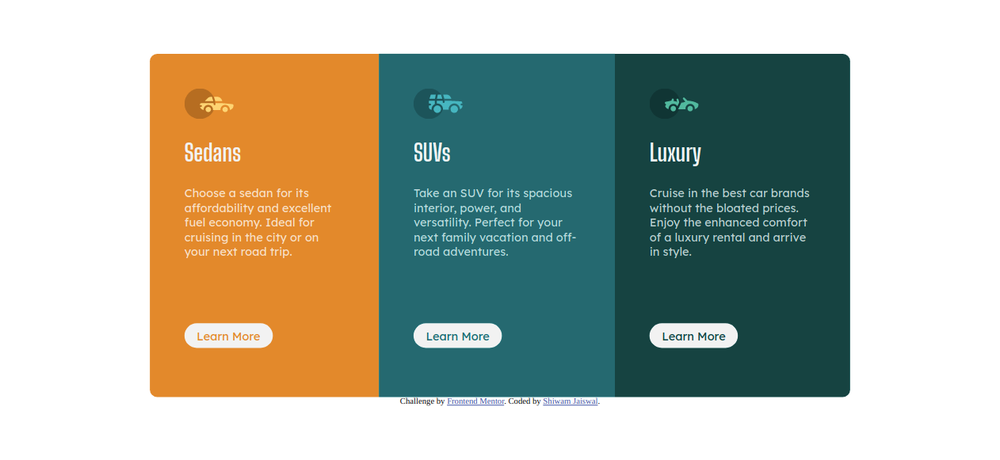

# Frontend Mentor - 3-column preview card component solution

This is a solution to the [3-column preview card component challenge on Frontend Mentor](https://www.frontendmentor.io/challenges/3column-preview-card-component-pH92eAR2-). Frontend Mentor challenges help you improve your coding skills by building realistic projects. 

## Table of contents

- [Overview](#overview)
  - [The challenge](#the-challenge)
  - [Screenshot](#screenshot)
  - [Links](#links)
- [My process](#my-process)
  - [Built with](#built-with)
- [Author](#author)
- [Acknowledgments](#acknowledgments)

**Note: Delete this note and update the table of contents based on what sections you keep.**

## Overview

### The challenge

Users should be able to:

- View the optimal layout depending on their device's screen size
- See hover states for interactive elements

### Screenshot
Web-View

Mobile-View

### Links

- Solution URL: [Solution](https://www.frontendmentor.io/challenges/3column-preview-card-component-pH92eAR2-/hub/3-columnpreviewcardcomponent-using-flexbox-ihZ01itP9)
- Live Site URL: [Github Pages](https://jshiwam.github.io/3-column-preview/)

## My process

### Built with

- Semantic HTML5 markup
- CSS custom properties
- Flexbox

## Author

- Website - [Shiwam Jaiswal](https://github.com/jshiwam)
- Frontend Mentor - [@jshiwam](https://www.frontendmentor.io/profile/jshiwam)

## Acknowledgments

frontendmentor.io Slack Channel
